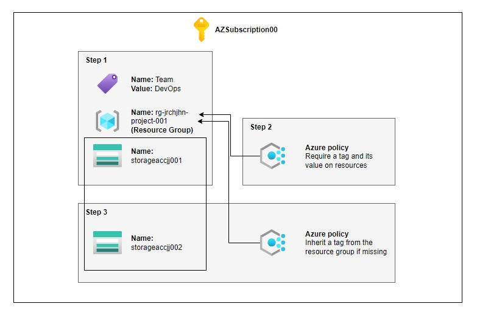

<h1 align="center" style="display: block; font-size: 2.5em; font-weight: bold; margin-block-start: 1em; margin-block-end: 1em;">
Managing and Enforcing Tags on Azure Resources
</h1>
<!-- [![Go version][go_version_img]][go_dev_url]
https://img.shields.io/badge/Microsoft-Azure-blue?style=for-the-badge -->

<!-- 

 -->

## Description

This project focuses on efficiently managing and enforcing resource tagging in Azure using the Azure portal and built-in policies to streamline organization and governance. Tags play a vital role in categorizing resources based on departments, projects, or environments, simplifying resource management, cost tracking, and reporting. The tasks within the project emphasize both manual and automated tagging, ensuring consistency across resources. By enforcing tagging policies, administrators can require specific tags for resource creation and automatically apply missing tags, leading to better organization, cost optimization, and policy compliance across Azure environments.

## Architecture and Diagram

## Requirements

- Existing Subscription
- Existing Resource Group
- Existing Storage Account

## Objectives

- **Step 1: Create and assign tags using Azure Portal**
- **Step 2: Enforce tagging of resource using Azure policy**
- **Step 3: Apply tagging using Azure policy**

### **Step 1: Create and assign tags using Azure Portal**

To begin, locate the **`rg-jrchjhn-project-001`** resource group for testing purposes. Add a tag to this resource group and assign a specific value to the tag. Confirm that the associated storage account within the resource group does not have the newly assigned tag.

- Go to your resource group **`rg-jrchjhn-project-001`** from your storage account **`storageaccjj001`.**

  

- Under the resource group Tags, add **`Team`** under Name and **`DevOps`** under Value. Click apply.
  

### **Step 2: Enforce tagging of resource using Azure policy**

Find the _"Require a tag and its value on resources"_ built-in policy and review its definition. Apply this policy to the resource group, configuring the required tag as **`Team`** with the value set to **`DevOps`**. Test the policy by attempting to create a new storage account within the resource group, and verify that the resource cannot be created without the specified tag.

- Navigate to Policy, click on Definitions under Authoring, and search for:

  _Require a tag and its value on resource groups_

  

- Click on Assign Policy

  

- Click on the scope ellipsis button, specify the Azure subscription and Resource Group

  

- Input the assignment name required for resource tag and its description. Then click next.

  

- Moving to the parameters tab, make sure to input the Tag Name and Tag Value

  

- Head to Review + Create and click on Create button

  

- Lets try to create **`storageaccjj002`** under the resource group **`rg-jrchjhn-project-001`.** After clicking on **Review + create**, it will generate an error because we have skipped the required tags
  
  _Note: The effect of enforcing a policy may take around 5-15 minutes_

### **Step 3: Apply tagging using Azure policy**

Now, we assign the _Inherit a tag from the resource group if missing_ built-in policy to the resource group. Set up remediation to ensure the _Role_ tag is automatically added if it is missing from any new resources. Let’s create a new storage account so the tag and its value are applied automatically.

- Navigate to Policy > Assignment and delete the created policy definition from Step 2

  

- Next, click Assign policy on the same page. Select the scope to the proper subscription **`AZSubscription00`** and resource group **`rg-jrchjhn-project-001` .** Click on the **Policy definition** ellipsis button, search for _inherit a tag from the resource group if missing_ and select the checkbox, then add. Click next.

  

- Under parameters tab, input **`Team`** for the tag name and click next

  

- In Remediation, click the **Create a remediation** checkbox and head over to **Review + create**

  

- Now, click **Create**

  

- Lets try the newly created policy and create a new storage named **`storageaccjj002` \*(**set to LRS - Replication and leave out other details)\* and click on **Review + create**
  
- As you can see, the Tag **`Team:DevOps`** has been inherited from the Azure policy we have created ensuring that enforcing policies worked.
  
